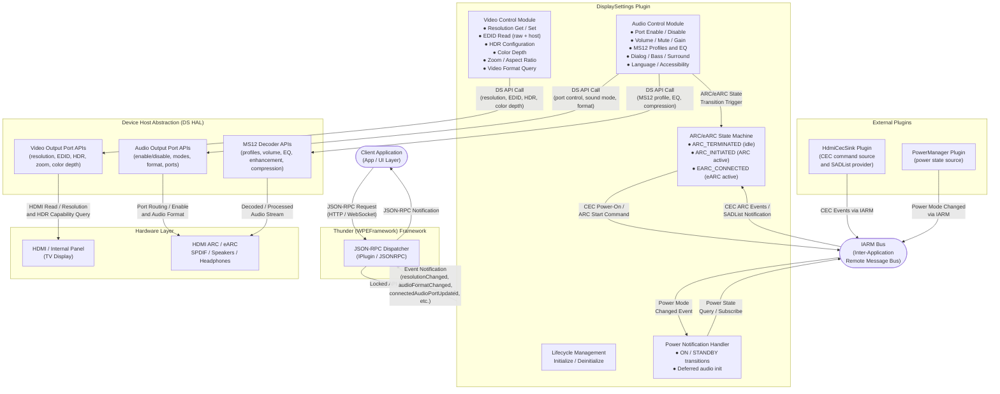

# DisplaySettings Plugin Specification

## Overview

The DisplaySettings plugin provides comprehensive APIs for video display and audio output management on RDK-based devices. It runs within the Thunder (WPEFramework) plugin framework and exposes JSON-RPC methods for:

- Video display configuration (resolutions, EDID, HDR, color depth, zoom)
- Audio port management (routing, enable/disable)
- Audio processing (MS12/Dolby enhancements, volume control)
- Multi-language audio and accessibility features

**Plugin Version:** 2.0.5

---

## Description

The DisplaySettings plugin is part of the Thunder (WPEFramework) plugin ecosystem deployed on RDK-based set-top box (STB) and smart TV devices. It acts as the single control surface for all video display and audio output configuration, abstracting the platform-specific Device Services (DS) HAL through a device host abstraction layer.

The plugin implements `PluginHost::IPlugin` and `PluginHost::JSONRPC`, registering all methods as locked APIs to ensure thread-safe concurrent access. It interacts with the IARM Bus for inter-plugin communication and listens for display hot-plug, audio port, and video device events from the hardware abstraction layer.

Key subsystems managed by the plugin include:

- **Video Control:** Resolution management, EDID reading, HDR configuration, and color depth control for HDMI and internal display ports.
- **Audio Control:** Port lifecycle (enable/disable), MS12/Dolby processing pipeline, surround virtualization, volume control, and accessibility features.
- **HDMI ARC/eARC State Machine:** Manages audio routing to connected AVR receivers via CEC commands, coordinating with the HdmiCecSink plugin over IARM Bus.
- **Power State Management:** Defers audio port initialization until the system transitions to the ON power state, and re-initializes after wake from standby.

---

## Requirements

### Functional Requirements — Video Display

- The plugin SHALL enumerate all connected and supported video display ports (HDMI, internal).
- The plugin SHALL allow querying and setting the current video resolution per display port, with optional persistence.
- The plugin SHALL return the default resolution for a display port.
- The plugin SHALL read raw EDID and host EDID data from connected displays.
- The plugin SHALL support zoom and aspect ratio configuration per display port.
- The plugin SHALL report connected video display connection state changes via events.
- The plugin SHALL support HDR configuration: query TV HDR support, set-top HDR support, and detailed TV HDR capabilities.
- The plugin SHALL support forcing a specific HDR mode.
- The plugin SHALL support color depth configuration (8/10/12-bit/auto) per display port.
- The plugin SHALL report whether the connected device is an HDCP repeater.
- The plugin SHALL report the active video input.
- The plugin SHALL query current video format details per display port.
- The plugin SHALL support legacy SCART parameter configuration.
- The plugin SHALL return comprehensive current output settings in a single call.

### Functional Requirements — Audio Output

- The plugin SHALL enumerate all connected and supported audio output ports.
- The plugin SHALL enable or disable individual audio output ports with persistence.
- The plugin SHALL query supported audio modes per port.
- The plugin SHALL query the current audio format per port.
- The plugin SHALL get and set the sound mode per port, with optional persistence.
- The plugin SHALL notify clients when audio port connection state changes.

### Functional Requirements — Audio Processing (MS12/Dolby)

- The plugin SHALL support volume level, mute, and gain control per audio port.
- The plugin SHALL support dynamic range compression (DRC) mode configuration per port.
- The plugin SHALL support MS12 audio compression level configuration per port.
- The plugin SHALL support Dolby volume mode configuration per port.
- The plugin SHALL support bass enhancement configuration (set/get/reset) per port.
- The plugin SHALL support surround virtualization configuration in v1 (boost + mode) and v2 (boost only) forms, with reset capability.
- The plugin SHALL support surround decoder enable/disable per port.
- The plugin SHALL support dialog enhancement configuration (set/get/reset) per port.
- The plugin SHALL support MI steering configuration per port.
- The plugin SHALL support graphic and intelligent equalizer mode configuration per port.
- The plugin SHALL support volume leveller configuration in v1 (level + mode) and v2 (level only) forms, with reset capability.
- The plugin SHALL support MS12 audio profile selection, get, and settings override per port.
- The plugin SHALL query supported MS12 audio profiles, MS12 configuration, and set-top MS12 capabilities.
- The plugin SHALL query set-top audio capabilities.

### Functional Requirements — Audio Routing & Accessibility

- The plugin SHALL support audio delay compensation (set/get) per port.
- The plugin SHALL query sink Atmos capability per port.
- The plugin SHALL support Atmos audio output mode configuration per port.
- The plugin SHALL support associated audio mixing for visually impaired users (set/get) per port.
- The plugin SHALL support fader control for audio mixing (set/get) per port.
- The plugin SHALL support primary and secondary audio language selection (set/get) per port using ISO 639-2 codes.

### Functional Requirements — HDMI ARC/eARC

- The plugin SHALL manage HDMI ARC/eARC routing via a dedicated state machine using CEC commands.
- The plugin SHALL coordinate with the HdmiCecSink plugin via IARM Bus for CEC communication.
- The plugin SHALL retrieve the Short Audio Descriptor list (SADList) via CEC.
- The plugin SHALL emit events when audio port connection state changes, including ARC/eARC transitions.

### Non-Functional Requirements

- All JSON-RPC APIs SHALL be registered as locked APIs to ensure thread-safe concurrent access.
- Settings that support persistence SHALL survive device reboots.
- Audio port initialization SHALL be deferred until the system power state is ON.
- Hot-plug events SHALL trigger cache updates for display resolution and EDID data.
- Device layer exceptions SHALL be caught and logged; APIs SHALL return `success: false` on failure.
- Invalid port names SHALL return `success: false`.
- CEC/IARM communication failures SHALL be logged; retries SHALL be attempted.
- EDID reads may take 100–500ms (hardware dependent); this is expected behavior.

---

## Architecture / Design

The following diagram shows the full data and control flow from a client application through to the hardware layer, including all plugin interactions and external system dependencies.



### Component Summary

| Component | Role |
|---|---|
| Client Application | Sends JSON-RPC requests and receives event notifications |
| Thunder Framework | Routes JSON-RPC calls to the correct locked plugin handler |
| Video Control Module | Handles all video display queries and settings via DS HAL |
| Audio Control Module | Handles all audio port and MS12/Dolby processing via DS HAL |
| ARC/eARC State Machine | Manages HDMI ARC/eARC lifecycle via CEC over IARM Bus |
| Power Notification Handler | Defers/re-initializes audio on power state changes |
| DS HAL | Platform-specific abstraction for video/audio hardware |
| IARM Bus | Inter-plugin event bus for CEC and power state signaling |
| HdmiCecSink Plugin | Source of CEC events and SADList for ARC capability negotiation |
| PowerManager Plugin | Source of power mode changed events |
| Hardware Layer | Physical HDMI, ARC/eARC, SPDIF, and speaker hardware |

---

## External Interfaces

All APIs are exposed as JSON-RPC methods via the Thunder framework. The JSON-RPC method name format is:

```
org.rdk.DisplaySettings.1.<methodName>
```

All responses include a `success` (bool) field. On failure, `success: false` is returned.

### Video Display APIs

| Method | Description | Parameters | Returns | Error Conditions |
|---|---|---|---|---|
| `getConnectedVideoDisplays` | List currently connected video displays | — | `connectedVideoDisplays`: string[] | None |
| `getSupportedVideoDisplays` | List all supported video displays on platform | — | `supportedVideoDisplays`: string[] | None |
| `getSupportedTvResolutions` | List TV-supported resolutions from platform | `videoDisplay` (string, optional) | `supportedTvResolutions`: string[] | Invalid port: `success: false` |
| `getSupportedSettopResolutions` | List set-top box supported resolutions | — | `suppportedSettopResolutions`: string[] | None |
| `getCurrentResolution` | Get current active resolution | `videoDisplay` (string, optional) | `resolution`: string | Invalid port: `success: false` |
| `setCurrentResolution` | Set current resolution | `videoDisplay` (string, required), `resolution` (string, required), `persist` (bool, optional) | `success`: bool | Invalid port or resolution: `success: false` |
| `getDefaultResolution` | Get default resolution for a display | `videoDisplay` (string, optional) | `defaultResolution`: string | Invalid port: `success: false` |
| `getZoomSetting` | Get current zoom/aspect ratio setting | `videoDisplay` (string, optional) | `zoomSetting`: string | Invalid port: `success: false` |
| `setZoomSetting` | Set zoom/aspect ratio | `videoDisplay` (string, required), `zoomSetting` (string, required) | `success`: bool | Invalid port or value: `success: false` |
| `readEDID` | Read raw EDID data from connected display | `videoDisplay` (string, optional) | `EDID`: string (hex) | No display: empty; EDID read error: `success: false` |
| `readHostEDID` | Read host EDID data | `videoDisplay` (string, optional) | `EDID`: string (hex) | Error: `success: false` |
| `getActiveInput` | Get active video input | — | `activeInput`: string | None |
| `getVideoFormat` | Get current video format details | `videoDisplay` (string, optional) | Video format object | Invalid port: `success: false` |

### Advanced Video & Color APIs

| Method | Description | Parameters | Returns | Error Conditions |
|---|---|---|---|---|
| `setPreferredColorDepth` | Set preferred color depth | `videoDisplay` (string, required), `colorDepth` (string, required) | `success`: bool | Invalid port or value: `success: false` |
| `getPreferredColorDepth` | Get preferred color depth | `videoDisplay` (string, optional) | `colorDepth`: string | Invalid port: `success: false` |
| `getColorDepthCapabilities` | Get supported color depth capabilities | `videoDisplay` (string, optional) | `capabilities`: string[] | Invalid port: `success: false` |
| `setForceHDRMode` | Force specific HDR mode | `videoDisplay` (string, required), `mode` (string, required) | `success`: bool | Unsupported mode: `success: false` |
| `getTvHDRSupport` | Get TV HDR support (legacy) | — | HDR support info object | None |
| `getSettopHDRSupport` | Get set-top HDR support | — | HDR capabilities object | None |
| `getTVHDRCapabilities` | Get detailed TV HDR capabilities | `videoDisplay` (string, optional) | HDR capabilities object | Invalid port: `success: false` |
| `isConnectedDeviceRepeater` | Check if connected device is an HDCP repeater | — | `HdcpRepeater`: bool | None |
| `setScartParameter` | Set SCART parameter (legacy video output) | `videoDisplay` (string, required), `param` (string, required), `value` (string, required) | `success`: bool | Invalid params: `success: false` |
| `getCurrentOutputSettings` | Get all current output settings | — | Comprehensive settings object | None |

### Audio Port Management APIs

| Method | Description | Parameters | Returns | Error Conditions |
|---|---|---|---|---|
| `getConnectedAudioPorts` | List currently connected audio ports | — | `connectedAudioPorts`: string[] | None |
| `getSupportedAudioPorts` | List all supported audio ports | — | `supportedAudioPorts`: string[] | None |
| `setEnableAudioPort` | Enable or disable an audio output port | `audioPort` (string, required), `enable` (bool, required) | `success`: bool | Invalid port: `success: false` |
| `getEnableAudioPort` | Get enable/disable status of audio port | `audioPort` (string, required) | `enable`: bool | Invalid port: `success: false` |
| `getSupportedAudioModes` | List supported audio modes for a port | `audioPort` (string, required) | `supportedAudioModes`: string[] | Invalid port: `success: false` |
| `getAudioFormat` | Get current audio format for a port | `audioPort` (string, required) | `audioFormat`: string | Invalid port: `success: false` |
| `getSoundMode` | Get current sound mode | `audioPort` (string, optional) | `soundMode`: string | Invalid port: `success: false` |
| `setSoundMode` | Set sound mode | `audioPort` (string, required), `soundMode` (string, required), `persist` (bool, optional) | `success`: bool | Invalid port or mode: `success: false` |

### Audio Processing APIs — Volume & Dynamics Control

| Method | Description | Parameters | Returns | Error Conditions |
|---|---|---|---|---|
| `setVolumeLevel` | Set volume level | `audioPort` (string, required), `volumeLevel` (int 0–100, required) | `success`: bool | Invalid port or level: `success: false` |
| `getVolumeLevel` | Get current volume level | `audioPort` (string, required) | `volumeLevel`: int 0–100 | Invalid port: `success: false` |
| `setMuted` | Mute or unmute audio | `audioPort` (string, required), `muted` (bool, required) | `success`: bool | Invalid port: `success: false` |
| `getMuted` | Get mute status | `audioPort` (string, required) | `muted`: bool | Invalid port: `success: false` |
| `setGain` | Set audio gain | `audioPort` (string, required), `gain` (float dB, required) | `success`: bool | Invalid port or gain: `success: false` |
| `getGain` | Get current audio gain | `audioPort` (string, required) | `gain`: float (dB) | Invalid port: `success: false` |
| `setVolumeLeveller` | Set volume leveller (v1) | `audioPort` (string, required), `level` (int, required), `mode` (int, required) | `success`: bool | Invalid port: `success: false` |
| `getVolumeLeveller` | Get volume leveller settings (v1) | `audioPort` (string, required) | `level`: int, `mode`: int | Invalid port: `success: false` |
| `setVolumeLeveller2` | Set volume leveller (v2) | `audioPort` (string, required), `level` (int, required) | `success`: bool | Invalid port: `success: false` |
| `getVolumeLeveller2` | Get volume leveller settings (v2) | `audioPort` (string, required) | `level`: int | Invalid port: `success: false` |
| `resetVolumeLeveller` | Reset volume leveller to default | `audioPort` (string, required) | `success`: bool | Invalid port: `success: false` |
| `setDRCMode` | Set dynamic range compression mode | `audioPort` (string, required), `DRCMode` (string, required) | `success`: bool | Invalid port or mode: `success: false` |
| `getDRCMode` | Get DRC mode | `audioPort` (string, required) | `DRCMode`: string ("line" or "RF") | Invalid port: `success: false` |
| `setMS12AudioCompression` | Set MS12 audio compression | `audioPort` (string, required), `compressionlevel` (int, required) | `success`: bool | Invalid port: `success: false` |
| `getMS12AudioCompression` | Get MS12 audio compression level | `audioPort` (string, required) | `compressionlevel`: int | Invalid port: `success: false` |
| `setDolbyVolumeMode` | Set Dolby volume mode | `audioPort` (string, required), `dolbyVolumeMode` (bool, required) | `success`: bool | Invalid port: `success: false` |
| `getDolbyVolumeMode` | Get Dolby volume mode | `audioPort` (string, required) | `dolbyVolumeMode`: bool | Invalid port: `success: false` |

### Audio Processing APIs — Audio Enhancement

| Method | Description | Parameters | Returns | Error Conditions |
|---|---|---|---|---|
| `setBassEnhancer` | Set bass enhancement level | `audioPort` (string, required), `bassBoost` (int 0–100, required) | `success`: bool | Invalid port: `success: false` |
| `getBassEnhancer` | Get bass enhancement level | `audioPort` (string, required) | `bassBoost`: int 0–100 | Invalid port: `success: false` |
| `resetBassEnhancer` | Reset bass enhancer to default | `audioPort` (string, required) | `success`: bool | Invalid port: `success: false` |
| `setSurroundVirtualizer` | Set surround virtualization (v1) | `audioPort` (string, required), `surroundVirtualizer` object with `boost` (int) and `mode` (int), required | `success`: bool | Invalid port: `success: false` |
| `getSurroundVirtualizer` | Get surround virtualization settings (v1) | `audioPort` (string, required) | `surroundVirtualizer` object with `boost` and `mode` | Invalid port: `success: false` |
| `setSurroundVirtualizer2` | Set surround virtualization (v2) | `audioPort` (string, required), `boost` (int 0–100, required) | `success`: bool | Invalid port: `success: false` |
| `getSurroundVirtualizer2` | Get surround virtualization settings (v2) | `audioPort` (string, required) | `boost`: int 0–100 | Invalid port: `success: false` |
| `resetSurroundVirtualizer` | Reset surround virtualizer to default | `audioPort` (string, required) | `success`: bool | Invalid port: `success: false` |
| `enableSurroundDecoder` | Enable/disable surround decoder | `audioPort` (string, required), `surroundDecoderEnable` (bool, required) | `success`: bool | Invalid port: `success: false` |
| `isSurroundDecoderEnabled` | Check if surround decoder is enabled | `audioPort` (string, required) | `surroundDecoderEnable`: bool | Invalid port: `success: false` |
| `setDialogEnhancement` | Set dialog enhancement level | `audioPort` (string, required), `enhancerlevel` (int 0–16, required) | `success`: bool | Invalid port: `success: false` |
| `getDialogEnhancement` | Get dialog enhancement level | `audioPort` (string, required) | `enhancerlevel`: int 0–16 | Invalid port: `success: false` |
| `resetDialogEnhancement` | Reset dialog enhancement to default | `audioPort` (string, required) | `success`: bool | Invalid port: `success: false` |
| `setMISteering` | Set MI steering | `audioPort` (string, required), `MISteeringenable` (bool, required) | `success`: bool | Invalid port: `success: false` |
| `getMISteering` | Get MI steering status | `audioPort` (string, required) | `MISteeringenable`: bool | Invalid port: `success: false` |

### Audio Processing APIs — Equalizer & Sound Profiles

| Method | Description | Parameters | Returns | Error Conditions |
|---|---|---|---|---|
| `setIntelligentEqualizerMode` | Set intelligent equalizer mode | `audioPort` (string, required), `intelligentEqualizerMode` (int, required) | `success`: bool | Invalid port or mode: `success: false` |
| `getIntelligentEqualizerMode` | Get intelligent equalizer mode | `audioPort` (string, required) | `intelligentEqualizerMode`: int | Invalid port: `success: false` |
| `setGraphicEqualizerMode` | Set graphic equalizer mode | `audioPort` (string, required), `graphicEqualizerMode` (int, required) | `success`: bool | Invalid port or mode: `success: false` |
| `getGraphicEqualizerMode` | Get graphic equalizer mode | `audioPort` (string, required) | `graphicEqualizerMode`: int | Invalid port: `success: false` |

### Audio Processing APIs — MS12 Profiles & Configuration

| Method | Description | Parameters | Returns | Error Conditions |
|---|---|---|---|---|
| `setMS12AudioProfile` | Set MS12 audio profile | `audioPort` (string, required), `ms12AudioProfile` (string, required) | `success`: bool | Invalid port or profile: `success: false` |
| `getMS12AudioProfile` | Get current MS12 audio profile | `audioPort` (string, required) | `ms12AudioProfile`: string | Invalid port: `success: false` |
| `getSupportedMS12AudioProfiles` | List supported MS12 audio profiles | `audioPort` (string, required) | `supportedMS12AudioProfiles`: string[] | Invalid port: `success: false` |
| `setMS12ProfileSettingsOverride` | Override MS12 profile settings | `audioPort` (string, required), `profileState` (string, required) | `success`: bool | Invalid port: `success: false` |
| `getSupportedMS12Config` | Get supported MS12 configuration | `audioPort` (string, required) | MS12 config details object | Invalid port: `success: false` |
| `getSettopMS12Capabilities` | Get set-top MS12 capabilities | `audioPort` (string, required) | MS12 capabilities object | Invalid port: `success: false` |
| `getSettopAudioCapabilities` | Get set-top audio capabilities | — | Audio capabilities object | None |

### Audio Routing & Accessibility APIs

| Method | Description | Parameters | Returns | Error Conditions |
|---|---|---|---|---|
| `setAudioDelay` | Set audio delay compensation | `audioPort` (string, required), `audioDelay` (int ms, required) | `success`: bool | Invalid port: `success: false` |
| `getAudioDelay` | Get audio delay setting | `audioPort` (string, required) | `audioDelay`: int (ms) | Invalid port: `success: false` |
| `getSinkAtmosCapability` | Get sink Atmos capability | `audioPort` (string, required) | `atmos_capability`: int | Invalid port: `success: false` |
| `setAudioAtmosOutputMode` | Set Atmos output mode | `audioPort` (string, required), `enable` (bool, required) | `success`: bool | Invalid port: `success: false` |
| `setAssociatedAudioMixing` | Set associated audio mixing for visually impaired users | `audioPort` (string, required), `mixing` (bool, required) | `success`: bool | Invalid port: `success: false` |
| `getAssociatedAudioMixing` | Get associated audio mixing status | `audioPort` (string, required) | `mixing`: bool | Invalid port: `success: false` |
| `setFaderControl` | Set fader control for audio mixing | `audioPort` (string, required), `mixerBalance` (int 0–100, required) | `success`: bool | Invalid port: `success: false` |
| `getFaderControl` | Get fader control setting | `audioPort` (string, required) | `mixerBalance`: int 0–100 | Invalid port: `success: false` |
| `setPrimaryLanguage` | Set primary audio language | `audioPort` (string, required), `primaryLanguage` (string ISO 639-2, required) | `success`: bool | Invalid port or language: `success: false` |
| `getPrimaryLanguage` | Get primary audio language | `audioPort` (string, required) | `primaryLanguage`: string (ISO 639-2) | Invalid port: `success: false` |
| `setSecondaryLanguage` | Set secondary audio language | `audioPort` (string, required), `secondaryLanguage` (string ISO 639-2, required) | `success`: bool | Invalid port or language: `success: false` |
| `getSecondaryLanguage` | Get secondary audio language | `audioPort` (string, required) | `secondaryLanguage`: string (ISO 639-2) | Invalid port: `success: false` |

---

### Data Models

#### Video Display Types

| Type | Values |
|---|---|
| `Resolution` | `"480i"`, `"480p"`, `"576i"`, `"576p"`, `"576p50"`, `"720p"`, `"720p50"`, `"1080i"`, `"1080p"`, `"1080p24"`, `"1080p25"`, `"1080p30"`, `"1080p50"`, `"1080p60"`, `"2160p24"`, `"2160p25"`, `"2160p30"`, `"2160p50"`, `"2160p60"` |
| `VideoDisplay` | Port names: `"HDMI0"`, `"HDMI1"`, `"INTERNAL"` (platform-specific) |
| `ZoomSetting` | `"None"`, `"Full"`, `"Normal"`, `"Zoom"`, `"Stretch"` |
| `ColorDepth` | `"8"`, `"10"`, `"12"`, `"auto"` (bits per channel) |
| `HDRFormat` | `"none"`, `"HDR10"`, `"HDR10PLUS"`, `"DolbyVision"`, `"HLG"` |

#### Audio Port Types

| Type | Values |
|---|---|
| `AudioPort` | `"HDMI0"`, `"HDMI_ARC0"`, `"SPDIF0"`, `"SPEAKER0"`, `"HEADPHONE0"`, `"IDLR0"` |
| `AudioMode` | `"STEREO"`, `"SURROUND"`, `"PASSTHRU"`, `"AUTO"` |
| `SoundMode` | `"STEREO"`, `"MONO"`, `"SURROUND"`, `"AUTO"` |
| `AudioFormat` | `"PCM"`, `"AC3"`, `"EAC3"`, `"AAC"`, `"Dolby Digital Plus"`, `"Dolby TrueHD"`, `"Dolby Atmos"` |

#### Audio Processing Value Ranges

| Type | Range / Values |
|---|---|
| `DRCMode` | `"line"` (light compression), `"RF"` (heavy compression) |
| `VolumeLevel` | Integer 0–100 |
| `Gain` | Float in dB (typically −2080.0 to +480.0) |
| `EnhancementLevel` | Integer 0–16 (bass, dialog, etc.) |
| `BoostLevel` | Integer 0–100 (virtualizer, bass) |
| `MixerLevel` | Integer 0–100 (fader control) |

#### MS12 Data Types

| Type | Values |
|---|---|
| `MS12Profile` | `"Movie"`, `"Music"`, `"Game"`, `"Sports"`, `"Night"`, `"User"` (platform-dependent) |
| `EqualizerMode` | Integer 0–N (platform-dependent mode IDs) |
| `LanguageCode` | ISO 639-2 codes: `"eng"`, `"spa"`, `"fra"`, etc. |

#### EDID Data

| Type | Description |
|---|---|
| `EDIDBytes` | Hexadecimal string representation of raw EDID data (128 or 256 bytes) |
| `EDIDInfo` | Parsed structure containing manufacturer ID, model, and display capabilities |

#### HDR Capabilities Object

```json
{
  "supportsHDR": true,
  "capabilities": ["HDR10", "DolbyVision", "HLG"],
  "standards": {
    "HDR10":        { "supported": true },
    "DolbyVision":  { "supported": true },
    "HLG":          { "supported": false }
  }
}
```

---

### Events & Notifications

The plugin publishes JSON-RPC event notifications to subscribed clients for the following state changes:

#### Video Events

| Event | Trigger |
|---|---|
| `resolutionChanged` | Video resolution changes |
| `zoomSettingChanged` | Zoom or aspect ratio setting changes |
| `connectedVideoDisplaysChanged` | Display connection state changes (hot-plug) |

#### Audio Events

| Event | Trigger |
|---|---|
| `connectedAudioPortUpdated` | Audio port connection state changes (including ARC/eARC transitions) |
| `audioFormatChanged` | Active audio format changes |
| `audioPortEnabledChanged` | Audio port enable or disable state changes |

---

### Behavior & Constraints

#### Video Display Behavior

- **Display Connection:** Hot-plug events trigger resolution and EDID cache updates. Internal displays always report as connected; HDMI displays reflect actual connection status.
- **Resolution Setting:** Requires the display to support the requested resolution. The `persist` flag saves the setting across reboots. Invalid resolutions return `success: false`. Platforms may apply the closest supported resolution.
- **Display Not Connected:** APIs return empty arrays; this is not treated as an error condition.
- **EDID Read Timing:** Hardware-dependent; may take 100–500ms.

#### Audio Port Behavior

- **Port Enable/Disable:** Only one primary audio port can be active simultaneously. Enabling a port may auto-disable others (platform-dependent). Settings persist per port across reboots.
- **Port Types:**
  - `HDMI0`: Standard HDMI audio output
  - `HDMI_ARC0`: HDMI Audio Return Channel (ARC/eARC)
  - `SPDIF0`: Digital optical output
  - `SPEAKER0`: Internal speakers
  - `HEADPHONE0`: Analog headphone jack
  - `IDLR0`: Internal digital audio (platform-specific)

#### HDMI ARC/eARC Handling

**Connection Flow:**
1. Plugin detects HDMI ARC port (`hdmiArcPortId`)
2. Subscribes to HdmiCecSink events via IARM Bus
3. Sends CEC power-on message to AVR
4. Waits for AVR response (with timeout and retry)
5. Detects ARC or eARC capability
6. Routes audio accordingly

**CEC Dependencies:**
- Requires HdmiCecSink plugin to be active
- CEC must be enabled for ARC/eARC functionality
- Audio device power state is monitored via CEC
- SADList (Short Audio Descriptor List) is retrieved via CEC

**ARC/eARC State Machine:**

| State | Meaning |
|---|---|
| `ARC_STATE_ARC_TERMINATED` | Initial / disconnected |
| `ARC_STATE_ARC_INITIATED` | ARC active |
| `ARC_STATE_EARC_CONNECTED` | eARC active (higher bandwidth) |

#### MS12 Audio Processing

- Requires Dolby MS12 audio decoder on the platform.
- Not all platforms support all MS12 features; availability is checked via `getSettopMS12Capabilities`.
- MS12 profiles are preset combinations of audio settings; overrides allow custom tuning.
- Profile changes may reset individual enhancement settings.
- v1 and v2 API variants are maintained for backward compatibility.

#### Power State Integration

- Audio ports are initialized only when the power state is ON.
- Video settings (EDID, resolution) can be queried in standby (data is cached).
- Full audio setup is deferred until the system is active.
- ON → STANDBY: Audio ports may be disabled.
- STANDBY → ON: Audio ports are re-initialized; ARC/eARC setup is re-triggered.

#### Persistence

| Setting | Persistence Scope |
|---|---|
| Audio port enable/disable | Per port, persists across reboots |
| Video resolution | Per display, when `persist: true` |
| Audio enhancement levels | Per port, persists across reboots |
| MS12 profile selection | Per port, persists across reboots |
| Zoom settings | Per video display, persists across reboots |

---

### API Usage Examples

#### Example: Enable HDMI Audio Port

**Request:**
```json
{
  "jsonrpc": "2.0",
  "id": 5,
  "method": "org.rdk.DisplaySettings.1.setEnableAudioPort",
  "params": {
    "audioPort": "HDMI0",
    "enable": true
  }
}
```

**Response:**
```json
{ "success": true }
```

---

#### Example: Set Dialog Enhancement

**Request:**
```json
{
  "jsonrpc": "2.0",
  "id": 7,
  "method": "org.rdk.DisplaySettings.1.setDialogEnhancement",
  "params": {
    "audioPort": "HDMI0",
    "enhancerlevel": 12
  }
}
```

**Response:**
```json
{ "success": true }
```

---

#### Example: Get Color Depth Capabilities

**Request:**
```json
{
  "jsonrpc": "2.0",
  "id": 9,
  "method": "org.rdk.DisplaySettings.1.getColorDepthCapabilities",
  "params": { "videoDisplay": "HDMI0" }
}
```

**Response:**
```json
{
  "success": true,
  "capabilities": ["8", "10", "12", "auto"]
}
```

---

#### Example: Set MS12 Audio Profile

**Request:**
```json
{
  "jsonrpc": "2.0",
  "id": 11,
  "method": "org.rdk.DisplaySettings.1.setMS12AudioProfile",
  "params": {
    "audioPort": "HDMI0",
    "ms12AudioProfile": "Movie"
  }
}
```

**Response:**
```json
{ "success": true }
```

---

#### Example: Get Connected Audio Ports

**Request:**
```json
{
  "jsonrpc": "2.0",
  "id": 13,
  "method": "org.rdk.DisplaySettings.1.getConnectedAudioPorts"
}
```

**Response:**
```json
{
  "success": true,
  "connectedAudioPorts": ["HDMI0", "HDMI_ARC0", "SPEAKER0"]
}
```

---

#### Example: Set Primary Language

**Request:**
```json
{
  "jsonrpc": "2.0",
  "id": 15,
  "method": "org.rdk.DisplaySettings.1.setPrimaryLanguage",
  "params": {
    "audioPort": "HDMI0",
    "primaryLanguage": "eng"
  }
}
```

**Response:**
```json
{ "success": true }
```

---

## Performance

- Resolution and capability queries are fast synchronous operations served from cached platform or HAL data.
- EDID reads are hardware-dependent and may take **100–500ms**.
- CEC communication adds latency to ARC/eARC setup flows; timeout and retry logic is built into the state machine.
- Audio enhancement changes (MS12 profiles, EQ, volume) take effect immediately with no observable latency.
- All APIs use locked method registration (`registerMethodLockedApi`) to ensure thread safety without significant throughput overhead.

_No explicit SLA-bound performance targets are defined in the original specification._

---

## Security

- All JSON-RPC methods are registered as locked APIs via `Utils::Synchro::RegisterLockedApiForHandler`, preventing concurrent unsafe access.
- The plugin runs within the Thunder framework sandboxing model; no additional access-control layer is defined in this specification.
- CEC and IARM communication is intra-device only; no network-facing attack surface is introduced by this plugin.

_No explicit threat model or elevated trust-level requirements are defined in the original specification. See Open Queries._

---

## Versioning & Compatibility

- **Current Plugin Version:** 2.0.5
- The plugin registers methods under the JSON-RPC namespace `org.rdk.DisplaySettings.1`.
- Some APIs exist in v1 and v2 variants (e.g., `setVolumeLeveller` / `setVolumeLeveller2`, `setSurroundVirtualizer` / `setSurroundVirtualizer2`):
  - v2 APIs typically have a simplified parameter structure.
  - Both versions are maintained and functional for backward compatibility.
- New APIs are additive (non-breaking); existing API signatures are not modified between versions.
- Platform variance: not all audio ports and MS12 features are available on all platforms. Clients should use capability-query APIs (`getSettopMS12Capabilities`, `getSettopAudioCapabilities`, `getTVHDRCapabilities`) before invoking optional features.

---

## Conformance Testing & Validation

### Test Strategy

The plugin uses a two-tier test strategy:

| Tier | Scope | Location |
|---|---|---|
| **L1 — Unit Tests** | Individual method handler logic, parameter validation, mock HAL responses | `Tests/L1Tests/` |
| **L2 — Integration Tests** | End-to-end JSON-RPC flows with real or emulated hardware/platform | `Tests/L2Tests/tests/DisplaySettings_L2Test.cpp` |

### L1 Unit Test Coverage Goals

- All JSON-RPC handlers invoked with valid parameters return `success: true`.
- All JSON-RPC handlers invoked with invalid port names return `success: false`.
- All JSON-RPC handlers invoked with out-of-range values return `success: false`.
- DS HAL error injection returns `success: false` and logs appropriately.
- Power state transitions (ON ↔ STANDBY) trigger correct initialization and deinitialization behavior.

### L2 Integration Test Coverage Goals

- Video resolution query and setting flows on a real HDMI display.
- Audio port enable/disable with persistence verification across reboot.
- MS12 audio profile set/get round-trip.
- HDMI ARC/eARC connection and state machine progression.
- Event emission verification (resolution change, audio port change).

### Build & Run

Refer to `Tests/README.md` for build prerequisites, cmake flags, and test execution instructions.

---

## Covered Code

- `plugin/DisplaySettings.cpp` — `DisplaySettings::Initialize`, `DisplaySettings::Deinitialize`, all registered JSON-RPC handler methods (60+ methods), ARC/eARC state machine logic, power notification handler, IARM event subscriptions.
- `plugin/DisplaySettings.h` — `DisplaySettings` class declaration, `PowerManagerNotification` inner class, type aliases.
- `plugin/Module.cpp` — Thunder plugin module registration entry point.
- `plugin/Module.h` — Module namespace definitions.
- `plugin/DisplaySettings.conf.in` / `plugin/DisplaySettings.config` — Plugin runtime configuration (autostart, callsign, classname).
- `Tests/L2Tests/tests/DisplaySettings_L2Test.cpp` — L2 integration test suite.

---

## Open Queries

- The specification does not define an explicit security model or access-control policy (e.g., which Thunder security tokens or trust levels are required to invoke write operations such as `setCurrentResolution` or `setEnableAudioPort`). Should privileged access be required?
- The response schema for `getCurrentOutputSettings` is described only as "Comprehensive settings object" with no formal JSON definition. A full typed schema should be documented.
- The exact parameter names and typed schemas for `getSoundMode` response and `setSoundMode` request are not fully specified in the original spec.
- Platform-specific port availability (e.g., `IDLR0`, `INTERNAL`) is noted as platform-dependent but not enumerated per platform or device family. A compatibility matrix would improve clarity.
- `setScartParameter` is documented as legacy but no deprecation policy or planned removal timeline is stated.
- MS12 feature availability per platform is variable, but no documented registry or feature-flag mechanism exists beyond `getSettopMS12Capabilities` at runtime.

---

## References

- [Thunder (WPEFramework) Plugin Development Guide](https://rdkcentral.github.io/Thunder/)
- [RDK Device Services (DS) HAL API Documentation](https://wiki.rdkcentral.com/display/DS/Device+Settings+HAL+API)
- [HDMI CEC Specification — HDMI Licensing LLC](https://www.hdmi.org/spec/CEC)
- [Dolby MS12 Multistream Decoder — Dolby Laboratories](https://professional.dolby.com/product/dolby-ms12/)
- [ISO 639-2 Language Codes — Library of Congress](https://www.loc.gov/standards/iso639-2/)
- [IARM Bus Interface — RDK Central](https://wiki.rdkcentral.com/display/RDK/IARM+Bus)
- Related plugin: `HdmiCecSink` (required for ARC/eARC functionality)
- Related plugin: `PowerManager` (required for power state management)

---

## Change History

- [2026-04-23] - openspec-templater - Regenerated to match spec template format. ASCII architecture diagram replaced with Mermaid diagram. Content reorganized from 9-section custom format into standard template sections. `getSupportedResolutions` excluded (introduced exclusively by archived change `2026-04-14-get-supported-resolutions`).
